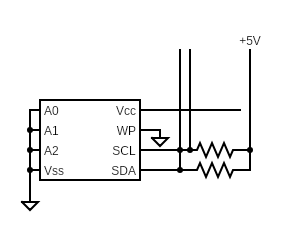

A Freedom Metal I2C implementation to read and write from a National Semiconductor NM24C17 EEPROM.

For details see the accompanying [blog post](https://dev.iachieved.it/iachievedit/i2c-with-the-sifive-hifive1-rev-b/).
